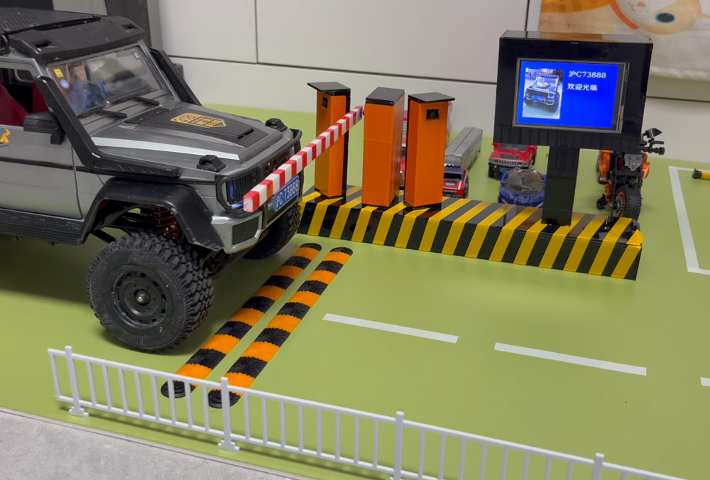

# MiniPark

MiniPark by AI手工星（微信：15158106211，添加微信，加入迷你停车场交流群）

# 项目简介
迷你停车场项目，通过树莓派、usb摄像头、舵机，实现了一个迷你版的停车场车牌识别收费系统。可玩性非常高。通过该项目可以学习到车牌识别相关的原理和方法。

# 目录结构
* CAD图纸：外观设计的图纸
* 硬件连接图：树莓派与usb摄像头，舵机的硬件连接图
* 树莓派代码：在树莓派上实现停车收费的全部源代码